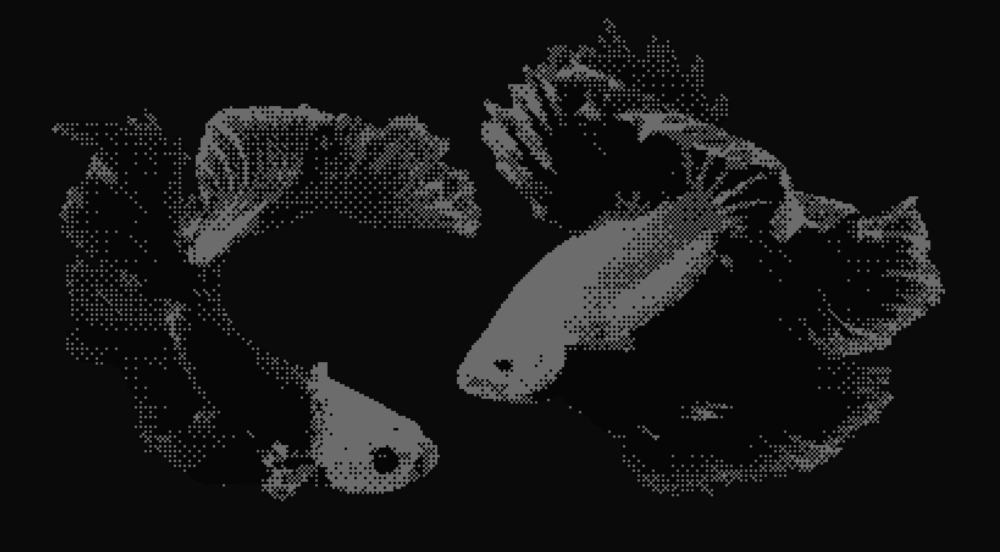
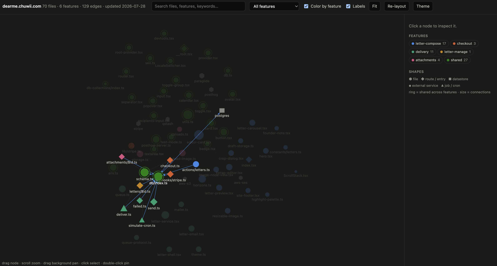

<a href="https://x.com/chuchuwiiii"></a> [@chuchuwiiii](https://x.com/chuchuwiiii)

# Chuwii's Skills

### tidy

For agents that write a lot of code and leave a mess behind.

Knowing whether an agent is about to duplicate a function, misplace a file, or quietly grow a god file is hard to catch by hand. These skills give the agent a map of your codebase first, so it reuses what's there instead of reinventing it.

## Install

```bash
npx skills@latest add chuwong35122/skills
```

## Why use it?

**Agents don't know what already exists.** Without a knowledge map of the codebase, an agent will write second `formatCurrency` instead of importing it from your `utils` folder. This logic duplication rots your codebase in every agent session.

**tidy** creates up-to-date graph of your repo (files, symbols, and dependencies) that any agent can check before writing new code, and that surfaces cleanup opportunities (duplicates, dead code, god files).

## Reference

- **[tidy-map](tidy/tidy-map)** (`/tidy-map`): Scans your repo and builds `.tidy/graph.json`, a compressed knowledge graph of every file. Renders it as an interactive graph in HTML, and grep-friendly markdown. Touches no source. Runs automatically after each git commit if hook is installed.
- **[tidy-find](tidy/tidy-find)** (`/tidy-find`): Reads the graph and triages it into a ranked list of real findings: duplicate functions, code that should've been reused, misplaced modules, dead code, god files.
- **[tidy](tidy/tidy)** (`/tidy <finding>`): Securely apply fixes (tidy-up your code) from `/tidy-find`.

Works on any language or framework. The graph knows about files, symbols, and edges, never syntax.


